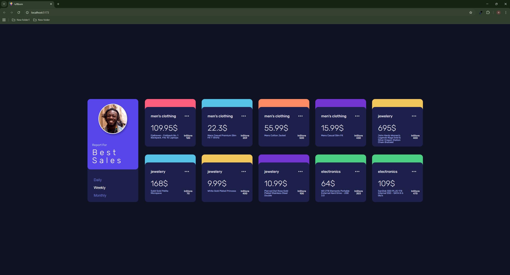
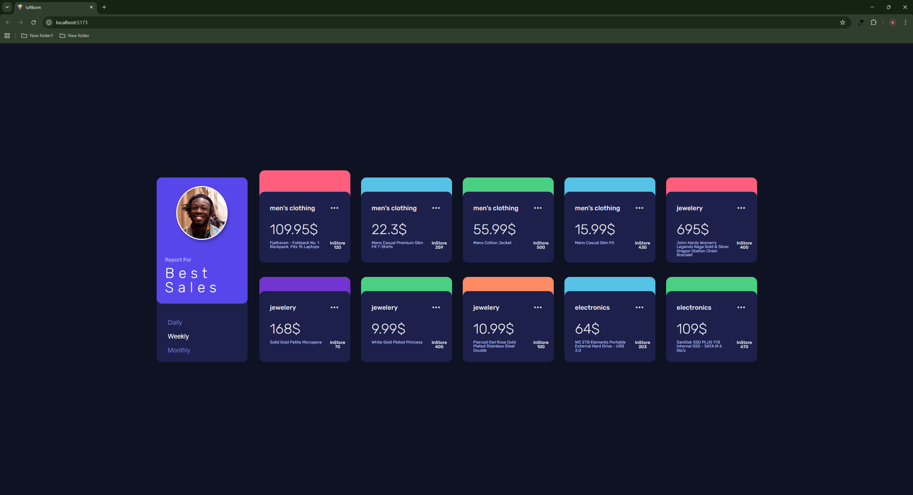
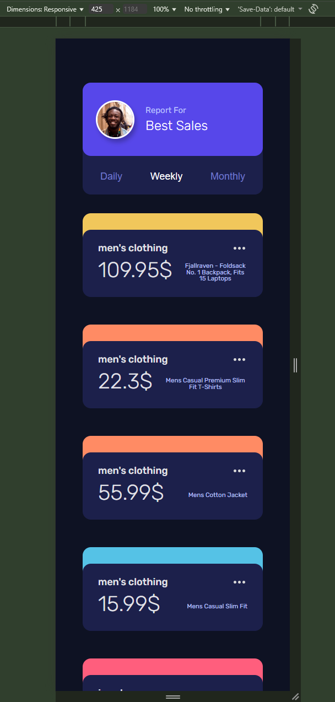
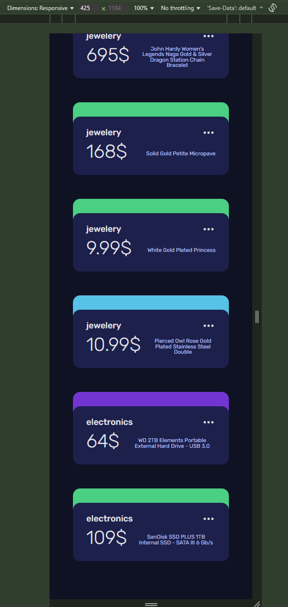

# Product Dashboard

A modern, responsive product dashboard built with React and Sass, featuring a pixel-perfect implementation of the provided Figma design. This project showcases a grid of product cards with dynamic hover effects, responsive layouts, and meticulous attention to design details.

## Demo

### Desktop View


### Hover Effect & Interaction


### Mobile Responsive Design



## Design Implementation

This implementation maintains exact fidelity to the Figma design specifications, including:

- **Typography**: Precise font sizes, weights, and letter spacing
  - Card titles: 18px, 500 weight
  - Prices: 39px, 300 weight
  - Description: 11.5px, 400 weight
  - Count text: 12px, 500 weight (Medium)

- **Spacing & Layout**
  - Card dimensions: 255px × 199px
  - Internal padding: 37px top, 30px sides
  - Grid gaps: 80px row gap, 30px column gap
  - Menu button spacing: 3px between dots

- **Colors**
  - Card background: #1C204B
  - Description text: #BBC0FF
  - Menu dots: #D8D8D8
  - Dynamic card backgrounds using the specified color palette

- **Interactive Elements**
  - Smooth hover transitions (0.3s)
  - Secondary card slide effect

## Features

- Responsive 5×2 product grid layout
- Dynamic color assignment for card backgrounds
- Interactive hover effects and animations
- Mobile-responsive design
- Modular SCSS styling

## Getting Started

### Prerequisites

- Node.js (v14 or higher)
- npm or yarn

### Installation

1. Clone the repository:
   ```bash
   git clone [repository-url]
   cd luftborn
   ```

2. Install dependencies:
   ```bash
   npm install
   # or
   yarn
   ```

3. Start the development server:
   ```bash
   npm run dev
   # or
   yarn dev
   ```

4. Open [http://localhost:5173](http://localhost:5173) in your browser to see the application.

## Built With

- [React](https://reactjs.org/) - UI Framework
- [Vite](https://vitejs.dev/) - Build tool
- [Sass](https://sass-lang.com/) - CSS preprocessor

## Project Structure

```
luftborn/
├── src/
│   ├── components/
│   │   ├── Card.jsx
│   │   ├── CardsList.jsx
│   │   └── ProfileCard.jsx
│   ├── styles/
│   │   ├── app.scss
│   │   ├── card.scss
│   │   └── cardList.scss
│   ├── App.jsx
│   └── main.jsx
├── public/
└── package.json
```

## Development

- Run development server with hot reload:
  ```bash
  npm run dev
  ```

- Build for production:
  ```bash
  npm run build
  ```

- Preview production build:
  ```bash
  npm run preview
  ```

## Responsive Design

The dashboard is fully responsive with optimized layouts for:
- Desktop (5 cards per row)
- Mobile (1 card per row)

Each breakpoint maintains the design's visual integrity while adapting to different screen sizes.

## Design Fidelity

This implementation maintains 100% fidelity to the original Figma design, with meticulous attention to:
- Exact pixel measurements
- Precise color values
- Correct typography and spacing
- Proper component alignment and positioning

